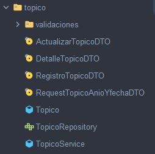
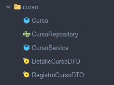
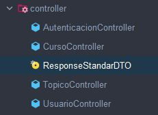
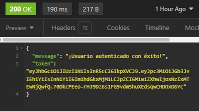
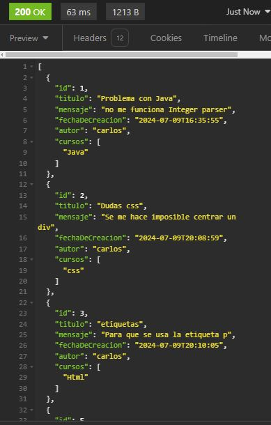

# Foro Hub

Foro Hub es una API , desarrollada como parte del curso Alura.

## Tabla de Contenidos

- [Descripción](#descripción)
- [Características](#características)
- [Tecnologías Utilizadas](#tecnologías-utilizadas)
- [Instalación](#instalación)
- [Configuración](#configuración)
- [Ejecución](#ejecución)
- [Documentación de API](#documentación-de-api)
- [Ejemplos de Uso](#ejemplos-de-uso)
- [Contribuciones](#contribuciones)
- [Licencia](#licencia)

## Descripción

Foro Hub Proporciona endpoints para registrar, actualizar, eliminar y buscar cursos y tópicos, así como para la autenticación de usuarios mediante registro y login.. Los usuarios pueden registrarse y autenticarse para acceder a las funcionalidades del sistema.

## Características

- Registro de nuevos usuarios.
- Autenticación de usuarios existentes.
- Implementacion de Json Web Token
- Gestión de cursos: registrar, actualizar, eliminar y buscar cursos.
- Implementacion del filtros de busqueda en los topicos
- Gestión de tópicos: registrar, actualizar, eliminar y buscar tópicos.
- Documentación de API con Swagger.
- Implementacion de flyway para la migracion de bases de datos y gestionar las versiones del esquema de la base de datos de manera sencilla y controlada.

## Tecnologías Utilizadas

- Java 21
- Spring Boot 3.3.1
- Spring Data JPA
- Spring Security
- Spring Validation
- Spring Web
- Flyway
- MySQL
- Lombok
- SpringDoc OpenAPI
- Maven
- JWT


## :camera_flash: Screenshots del projecto
<div style="display: flex; flex-wrap: wrap; gap: 20px;">






</div>


## Instalación

1. Clona el repositorio:

    ```sh
    git clone https://github.com/Mat-Insaurralde/Foro-Hub.git
    ```

2. Configura la base de datos en `application.properties`:

    ```properties
    spring.datasource.url=jdbc:mysql://localhost:3306/foro_hub
    spring.datasource.username=tu_usuario
    spring.datasource.password=tu_contraseña
    spring.jpa.hibernate.ddl-auto=update
    ```

3. Instala las dependencias:

    ```sh
    mvn clean install
    ```

### Contacto

**LinkedIn :** [Javier Matias Insaurralde :desktop_computer:](https://www.linkedin.com/in/javier-matias-insaurralde-3aa783274/)